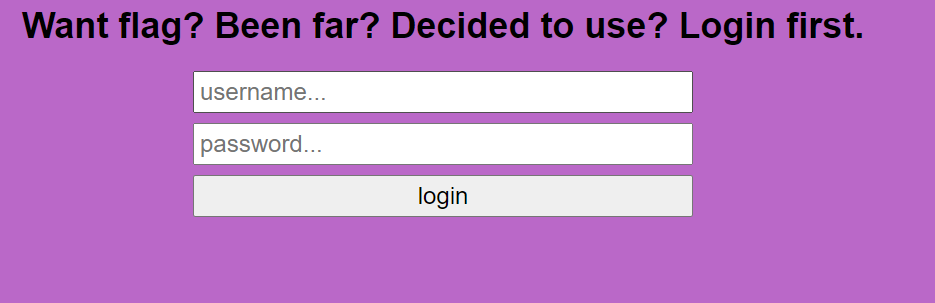

# Web Exploitation
## The Flash
### Description
The flag is displayed for 10 miliseconds before it disappears again 
and we have to somehow give ourselves enough time to see what it is


### Solution
#### Approach #1
Record your screen and go frame by frame until you see what the flag is
#### Approach #2
We know that the flag appears after every time interval x and only stays there for some time interval y. Since we can see the source code of the challenge, and we see that it's written in JS, we can check if the source code contains the usage of the `setInterval()` function since it's commonly used in JS to execute things after some specified time interval. After checking the source code, we see only one instance where the function is used, which is on line 18.


So we can set a breakpoint on line 21 (that's when the flag is going to be displayed) and we get the flag!


flag: actf{sp33dy_l1ke_th3_fl4sh}

## Auth Skip
### Description
We need to bypass the login panel in-order to get the flag



### Solution
In the source code that we are provided with, we see the following:


As we can see, this is very simple. All we have to do to get the flag is have a cookie with the name 'user' and the value 'admin'. After  adding that cookie and refreshing the page, we get the flag.

flag: actf{passwordless_authentication_is_the_new_hip_thing}

## Crumbs
### Description
We need to follow the crumbs (the urls we are given) until we get to the flag.

### Solution
Since there are 1000 urls that we need to follow, doing it manually would be really tedious. So i wrote a python script to automate the process:

```python
import requests

url = "https://crumbs.web.actf.co/"

r = requests.get(url)

while "actf" not in r.content.decode():
    try:
        r = requests.get(url + r.content.decode().split(" ")[2])
    except:
        pass
print(r.content.decode())
```

flag: actf{w4ke_up_to_th3_m0on_6bdc10d7c6d5}
